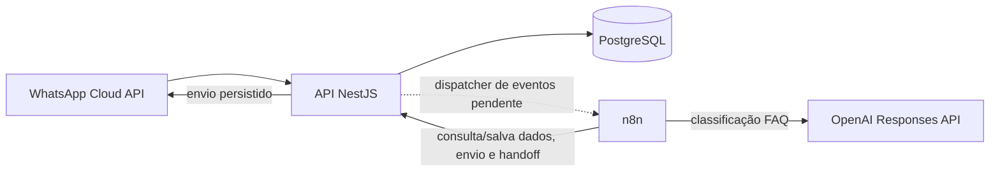

# n8n — automações de atendimento WhatsApp

Este diretório contém workflows n8n exportados em JSON para automatizar boas-vindas, qualificação de contatos, suporte com IA e pesquisa NPS. Os exports não incluem chaves, tokens ou IDs de credenciais. Eles são importados inativos para permitir configurar o ambiente antes de receber tráfego.

> **Estado da integração:** os arquivos JSON estão prontos para importação, mas ainda não executam ponta a ponta com a API deste repositório. O dispatcher de eventos e os endpoints internos usados pelos workflows ainda precisam ser implementados. Veja [Dependências do backend](#dependências-do-backend).

## Workflows

| Workflow | Arquivo | Evento de entrada | Ação |
| --- | --- | --- | --- |
| Boas-vindas | [01-boas-vindas.json](./workflows/01-boas-vindas.json) | `message.received` | Localiza o cliente, consulta se a saudação é devida e envia uma mensagem uma única vez. |
| Qualificação | [02-qualificacao.json](./workflows/02-qualificacao.json) | `qualification.requested` e respostas `message.received` | Pergunta nome, empresa e interesse em sequência; envia cada resposta para persistência no backend. |
| Suporte | [03-suporte.json](./workflows/03-suporte.json) | `message.received` | Carrega as FAQs da empresa, classifica a intenção com OpenAI e responde apenas com FAQ exata e score acima de 85. Caso contrário, solicita encaminhamento humano. |
| Pesquisa NPS | [04-pesquisa-nps.json](./workflows/04-pesquisa-nps.json) | `ticket.closed` | Envia uma pergunta de recomendação de 0 a 10, com chave idempotente por ticket. |

## Arquitetura

O backend deve publicar eventos autenticados nos Webhooks do n8n. Os workflows fazem a orquestração, enquanto a API valida o tenant, persiste alterações e envia mensagens pela integração WhatsApp já configurada.

O n8n não deve acessar o PostgreSQL diretamente. A API é responsável por isolamento multi-tenant, regras de domínio, persistência das mensagens, controle de idempotência e envio pela WhatsApp Cloud API.

## Requisitos de execução

- Instância n8n com acesso de rede à API e HTTPS público para receber os Webhooks de produção.
- Credencial de autenticação de entrada para chamadas do backend ao n8n.
- Credencial de serviço da API com contexto de empresa validado.
- Credencial da OpenAI no workflow de suporte.
- Endpoints internos e dispatcher listados abaixo.

Os nós HTTP usam `http://api:3001` como endereço inicial da API. Esse hostname só funciona quando n8n e API compartilham uma rede Docker que o resolva; ajuste a URL em cada nó HTTP Request para o endereço do ambiente. Este repositório ainda não possui Compose configurando n8n nem uma rede entre serviços.

## Importação e ativação

1. Importe cada arquivo JSON na interface do n8n usando **Import from File**.
2. Nos nós Webhook, associe uma credencial **Header Auth** e configure o dispatcher para enviar o mesmo header e segredo.
3. Nos nós HTTP Request da API, selecione uma credencial **Header Auth** com `Authorization: Bearer <token>`.
4. No workflow de suporte, configure outra credencial **Header Auth** para a OpenAI com `Authorization: Bearer <api-key>`.
5. Ajuste as URLs da API, configure os endpoints de origem e envie eventos de teste às URLs de teste do n8n.
6. Ative os workflows e configure o backend para chamar as URLs de produção exibidas pelos Webhooks.

Não ative os fluxos antes que as rotas internas estejam disponíveis. O Webhook do n8n possui URLs distintas de teste e produção; a URL de teste só fica registrada durante a escuta de teste, e a URL de produção é usada pelo workflow ativo ([documentação oficial](https://docs.n8n.io/integrations/builtin/core-nodes/n8n-nodes-base.webhook/)).

## Eventos encaminhados

O evento `message.received` deve incluir `eventId`, `companyId`, `ticketId`, `integrationId`, `customerId`, `contact` (incluindo telefone) e `message` (incluindo ID, tipo e texto). O dispatcher deve encaminhar cada mensagem somente aos fluxos aplicáveis:

- Boas-vindas: chamar para a mensagem recebida; o backend retorna `welcomeRequired: false` após a saudação inicial, impedindo respostas repetidas.
- Qualificação: emitir `qualification.requested` para iniciar a coleta e encaminhar mensagens do cliente ao fluxo enquanto a qualificação estiver ativa. Não encaminhar mensagens enviadas pelo bot como respostas do cliente.
- Suporte: encaminhar mensagens recebidas que precisam de classificação.
- NPS: ao encerrar o ticket, enriquecer o evento `ticket.closed` com empresa, cliente, integração WhatsApp e telefone do contato.

O contrato completo dos payloads, formato de retorno e rotas HTTP está em [workflows/README.md](./workflows/README.md).

## Dependências do backend

A API atual não implementa as seguintes rotas chamadas pelos workflows:

- `GET /internal/automation/customers/resolve` — busca o cliente por empresa/telefone e informa se a saudação ainda é devida.
- `POST /internal/automation/qualification/advance` — persiste respostas e retorna o próximo campo da qualificação.
- `POST /internal/automation/messages/text` — valida ticket e tenant, trata idempotência e chama `WhatsappService.sendText()`.
- `POST /internal/automation/ai/classifications` — persiste prompt, resposta, modelo, intenção, score e resultado.
- `POST /internal/automation/tickets/handoff` — encaminha o ticket para uma fila humana e registra a transição.
- Dispatcher de outbox para entrega autenticada dos eventos ao n8n, com retry e preservação de `eventId`.

`GET /ai/faqs` já existe, mas exige JWT de `ADMIN` ou `SUPERVISOR`. O encerramento já grava `ticket.closed` no outbox, porém o publisher atual entrega eventos ao Socket.IO, não ao n8n. O endpoint de FAQ também precisará aceitar a autenticação de serviço com contexto tenant válido, ou ser acessado através de um adaptador seguro.

## Segurança, tenant e retries

- Nunca coloque tokens ou chaves nos JSONs exportados; configure credenciais pela interface do n8n.
- Não use um token de administrador compartilhado entre empresas. O backend deve derivar ou validar a empresa pela credencial, não confiar apenas no `companyId` enviado no corpo ou query string.
- Resolva o destinatário de mensagens pelo ticket autenticado e pertencente à empresa; não permita que o workflow escolha um telefone arbitrário para envio.
- Os nós HTTP configurados para retry podem repetir uma chamada. As rotas de envio, qualificação e handoff devem deduplicar por `Idempotency-Key` antes de aplicar efeitos.
- No workflow de suporte, falha ao carregar FAQs, falha da OpenAI, score menor ou igual a 85 ou resposta fora da lista aprovada seguem para handoff. A resposta automática precisa corresponder exatamente a uma FAQ cadastrada.

Para os contratos detalhados e exemplos de payload, consulte [workflows/README.md](./workflows/README.md).
